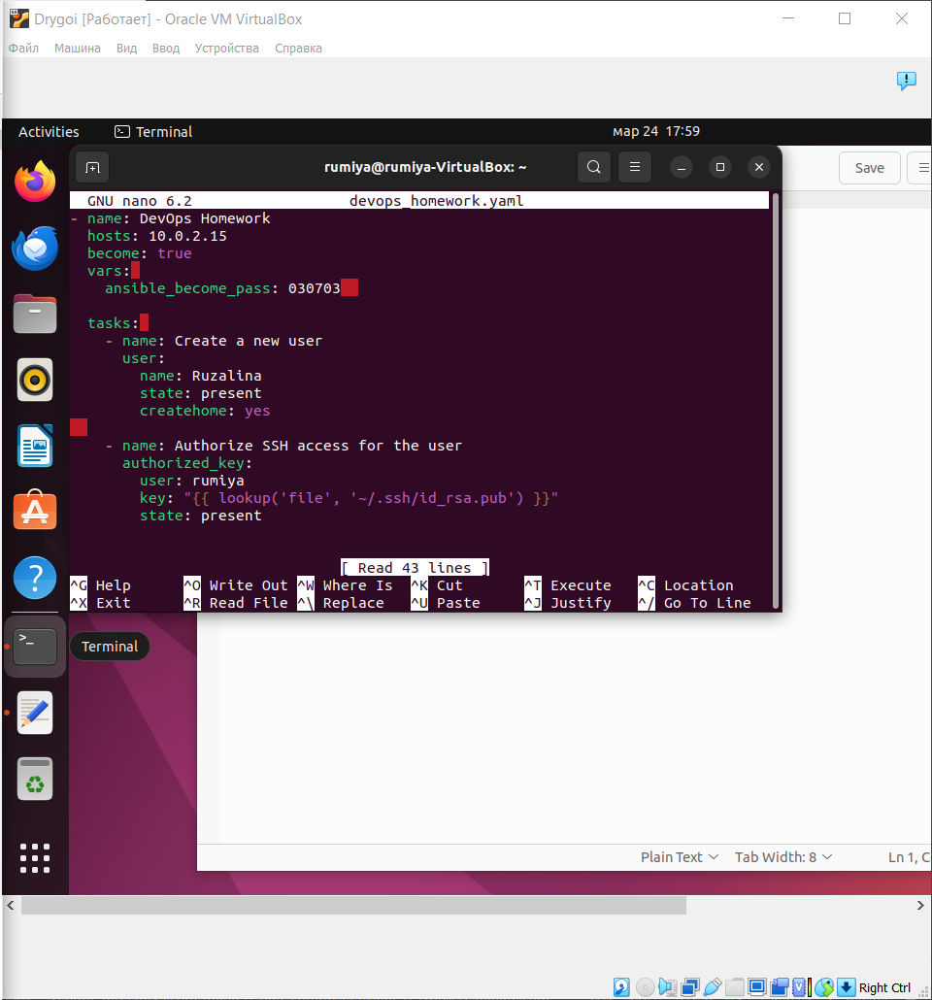
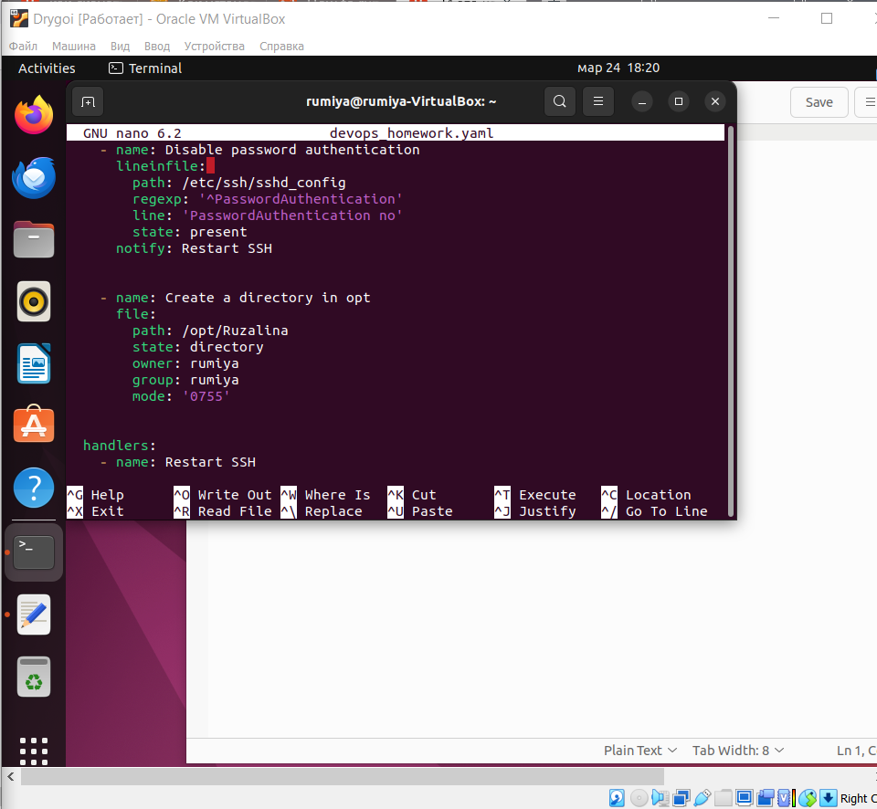
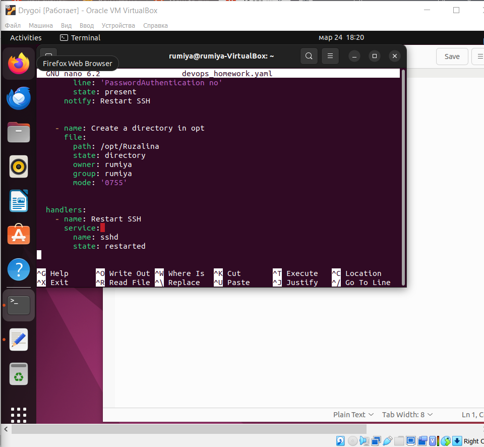
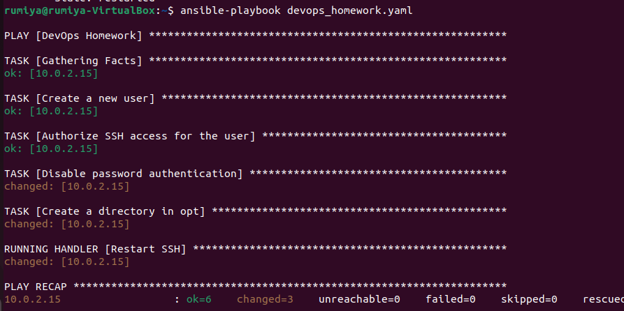
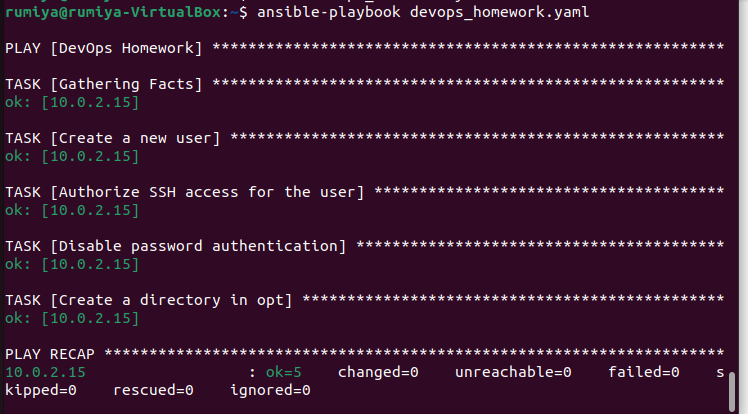
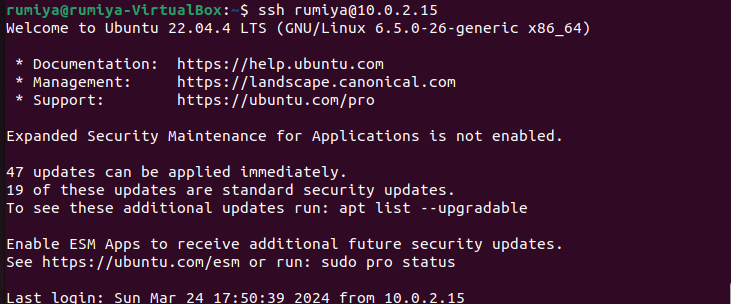
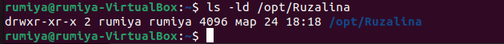

```
Задание: 
написать playbook который должен будет:
Создать пользователя на удаленной машине
Сделать авторизацию ssh по ключам для пользователя
Отключить авторизацию по паролю на сервере
Создать директорию в /opt/ с правами для пользователя.
```

Я все выполняла на виртуальной машине Ubuntu

Для начала установила Ansible c помощью команды sudo apt install ansible

***Отредактировала файл '/etc/ansible/hosts'***


***Создала файл с расширением 'devops_homework.yaml', написала туда следующий playbook***



```Запуск Playbook```

С помощью команды **ansible-playbook devops_homework.yml**

Правда 1 раз, когда запустила вышла эта картинка:



А при запуске 2 раз, уже по другому 



```Проверка```



