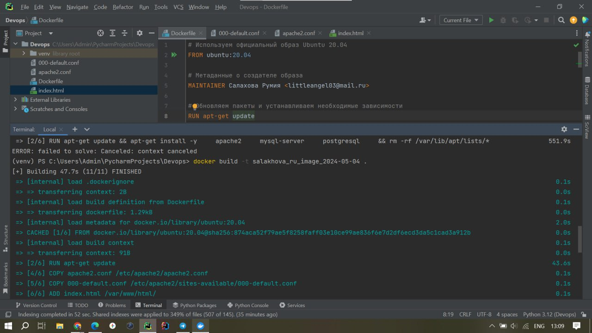

```
Задание: 1) Напишите Dockerfile для создания образа, который будет содержать веб-сервер Apache или Nginx и базу данных MySQL или postgresql. В Dockerfile должны использоваться инструкции: FROM, MAINTAINER, RUN, CMD, WORKDIR, ENV, ADD, COPY, VOLUME, USER, EXPOSE.
Dockerfile должен содержать комментарии с пояснениями того, что делается. 
Собранный образ должен иметь имя вида <фамилия>_<инициалы>_image_<текущая дата>. Рядом с dockerfile должен быть скрин, на котором будут видны все слои вашего image и их размер на диске и команда, которой вы это выведете.
```
Прописываем Dockerfile и дальше..

Создаем необходимые файлы: 
* apache2.conf:Этот файл содержит конфигурацию Apache HTTP Server.
* 000-default.conf:Этот файл представляет собой конфигурацию виртуального хоста Apache
* index.html:Этот файл представляет собой тестовую HTML-страницу, которая будет отображаться при доступе к веб-серверу Apache

После чего собираем образ командой: ``` docker build -t salakhova_ru_image_2024-05-04 . ```




Вывод слоев образа  ```docker history <имя_образа> ```


Образ создался

