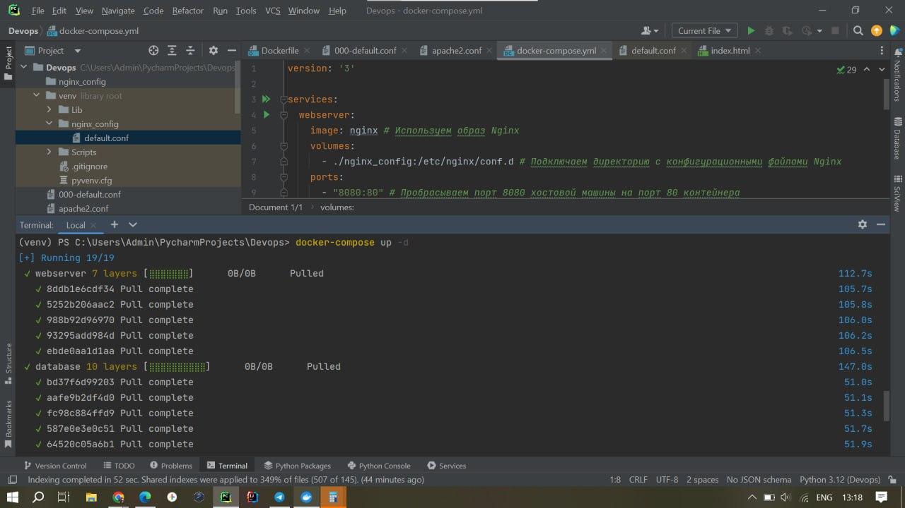
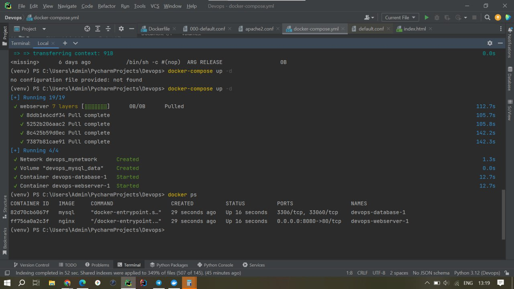

```
2) Напишите docker compose конфиг, для разворачивания двух контейнеров в одной сети (10.10.10.0/28) типа bridge: 
1 - Nginx или Apache или ваше самописное приложение на выбор, ему должны передаваться конфигурационные файлы через volume, порт 80 из контейнера должен быть доступен на хостовой машине по порту 8080
2 - mysql или postgres, каталог для хранения данных должен монтироваться как docker volume, docker volume должен быть описан в том же конфигурационном файле docker compose. Сервис с БД должен быть доступен из контейнера с веб-сервером по именам new_db, dev_db.
```

Создайте файл с именем docker-compose.yml 
nginx_config/default.conf - этот файл будет определять, как ваш веб-сервер будет обрабатывать запросы.

Запуск контейнеров с помощью команды ```docker-compose up -d```
Просмотр запущенных контейнеров возможен с помощью команды ```docker ps```

Результат: 


